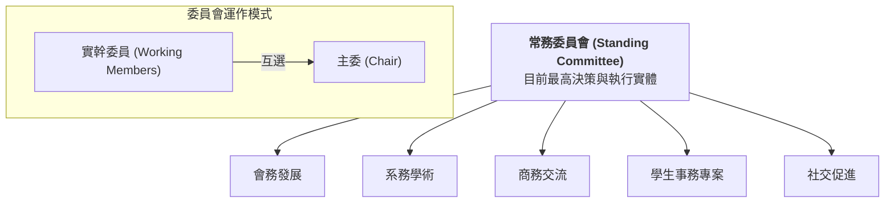

# 🏛️ 機械系系友會：組織架構與委員會職能

為了落實「薪火相傳、價值對位」的願景，系友會將建立五大專業委員會，作為推動會務的核心引擎。每個委員會由「志願委員」組成，並由委員互選產生「主委 (Chairperson)」。

---

## 🏗️ 組織架構圖 (現階段過渡架構)

> **備註**：目前「祕書處」之功能暫由常務委員會兼任，未來隨規模擴大後再行獨立設定。

---

## 📂 五大委員會職能詳述

### **1. 會務發展委員會**
*   **核心目標**：確保系友會的長期可持續性與資源基礎。
*   **關鍵任務**：
    *   推動系友會法人化 (A19 專案)。
    *   負責大型募資策略。
    *   規劃行政管理流程與數位轉型路徑。

### **2. 系務學術委員會**
*   **核心目標**：強化系友與母系研發能量的對接。
*   **關鍵任務**：
    *   將系上尖端技術資源 (Layer 1) 轉化為系友可理解的解決方案。
    *   推動「標籤圖譜」中的科研資源對位。
    *   協助系友尋找母系產學合作、專利技轉之對接點。

### **3. 商務交流委員會**
*   **核心目標**：建立「由內而外」的商務信任網路與實戰對流。
*   **關鍵任務**：
    *   促進跨世代系友企業間的供應鏈媒合與技術服務對接。
    *   舉辦「系友企業參訪」與「商務媒合專場」。
    *   負責維護資源引擎中的 S-02 (產業通路) 與 D-12 (供應鏈) 標籤。

### **4. 學生事務專案委員會**
*   **核心目標**：精準賦能學弟妹，加速人才梯隊建設。
*   **關鍵任務**：
    *   直接對接學生競賽專案 (賽車/火箭/機器人/Gokart)。
    *   推動導師計畫 (Mentorship) 與獎助學金的目標型投放。
    *   負責 A-01 (學生專案) 類別標籤的入庫與追蹤。

### **5. 社交促進委員會**
*   **核心目標**：厚化社群信用 (Social Credit) 與情感連結。
*   **關鍵任務**：
    *   建立各級別、各區域系友聯絡網。
    *   籌辦年會、系慶等大型團聚活動。
    *   經營數位社群與官網內容，提升系友會的在場感與認同感。

---

## 🚀 下一步行動
*   [ ] **種子委員邀約**：針對已知核心系友進行定向邀約。
*   [ ] **選拔流程基準化**：定義委員會互選主委的細則。
