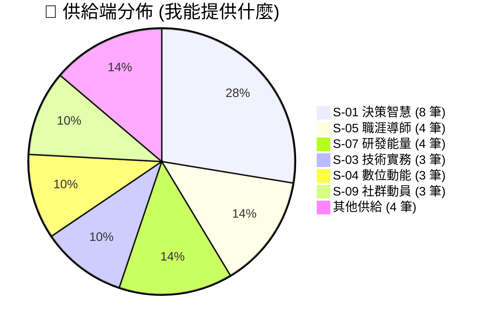
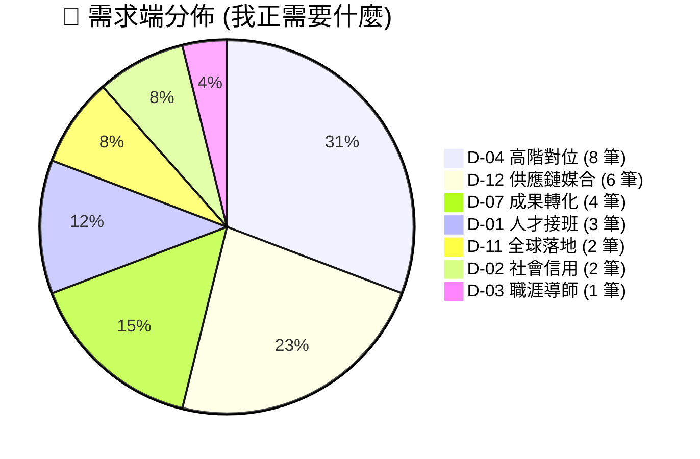

# 🚀 資源對接網絡：讓系友熱情精準轉化為動能

## 📊 資源圖譜即時概覽 (Real-time Resource Atlas)

目前資源池中合計有 **55 筆** 原子標籤紀錄。以下為資源類別分布分佈：

---

這不是傳統的名錄，而是一個 **「主應式」的賦能系統**。我們透過原子化的標籤，將學長的智慧 (S) 與學弟妹的需求 (D) 進行高品質的對位。

---

## ⚡ 核心行動：即刻填報資源
如果您現在有 3 分鐘的時間，請點選下方入口，讓您的專業與支持進入我們的對接地圖：



---

## 🧭 導覽與專案入口
請點選下方區塊，查看我們目前正在推動的關鍵對接計畫：


  


---

## 💡 為什麼要進行資源對位？
傳統的系友會往往面臨「資訊黑洞」：學長想幫忙卻不知道幫什麼，學弟妹有求卻不知道找誰。

**透過資源對接網絡，我們實現：**
*   **精準度**：不再是亂槍打鳥，而是根據 S-03 (技術實務) 或 D-04 (高階連結) 的需求進行自動篩選。
*   **低門檻**：系友只需要提供 30 分鐘的意見，就可能解決學生專案 3 個月的痛苦。
*   **價值可視化**：我們透過 AI 持續產出「資源地圖 (Atlas)」，讓系友看見集體的能量如何聚集。

> [!TIP]
> **現在就加入！** 您的每一筆錄入，都是交大機械系下一個五十年發展的重要燃料。
